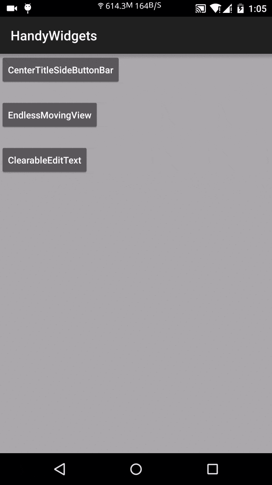

#ClearableEditText
[  ](https://bintray.com/piasy/maven/HandyWidgets/_latestVersion) [](https://android-arsenal.com/details/1/2455)  
A widget which has functions of EditText, has an optional icon, has a clear button, and also has a optional visibility checkbox for password edit, keeping with ability for full customization. This widget also provide method to get notified when text content changed, or editor action happens, in both traditional listener and popular Rx Observable way!

+  Screenshot  

+  Download
```groovy
    repositories {
        jcenter()
    }

    dependencies {
        compile 'com.github.piasy:clearableedittext:${latest version}'
    }
```
+  Usage
  +  In xml layout file:
  ```xml
    <com.github.piasy.handywidgets.clearableedittext.ClearableEditText
        xmlns:android="http://schemas.android.com/apk/res/android"
        xmlns:app="http://schemas.android.com/apk/res-auto"
        android:id="@+id/mEtUsername"
        android:layout_width="match_parent"
        android:layout_height="44dp"
        android:layout_marginTop="20dp"
        android:layout_marginLeft="15dp"
        android:layout_marginRight="15dp"
        android:background="@drawable/round_corner_bg"
        app:hasIcon="true"
        app:iconRes="@drawable/ic_person_blue_grey_500_24dp"
        app:iconMarginLeft="10dp"
        app:iconMarginRight="3dp"
        app:editTextSize="18sp"
        app:clearableEditTextHintColor="#777777"
        app:editTextHintContent="Username"
        app:clearIconRes="@drawable/clear_edit_selector"
        app:clearIconMarginLeft="10dp"
        app:clearIconMarginRight="10dp"
        app:editTextAutoFocus="true"
        />
  ```
  +  Use as password widget:
  ```xml
    <com.github.piasy.handywidgets.clearableedittext.ClearableEditText
        xmlns:android="http://schemas.android.com/apk/res/android"
        xmlns:app="http://schemas.android.com/apk/res-auto"
        android:id="@+id/mEtPassword"
        android:layout_width="match_parent"
        android:layout_height="44dp"
        android:layout_marginTop="10dp"
        android:layout_marginLeft="15dp"
        android:layout_marginRight="15dp"
        android:background="@drawable/round_corner_bg"
        android:inputType="textPassword"
        app:hasIcon="true"
        app:iconRes="@drawable/ic_vpn_key_blue_grey_500_24dp"
        app:iconMarginLeft="10dp"
        app:iconMarginRight="3dp"
        app:isPassword="true"
        app:editTextSize="18sp"
        app:clearableEditTextHintColor="#777777"
        app:editTextHintContent="Password"
        app:clearIconRes="@drawable/clear_edit_selector"
        app:clearIconMarginLeft="10dp"
        app:clearIconMarginRight="10dp"
        app:hasVisibilitySwitch="true"
        app:visibilitySwitchMarginRight="10dp"
        app:visibilitySwitchWidth="24dp"
        app:visibilitySwitchHeight="24dp"
        app:visibilitySwitchBg="@drawable/password_visibility_selector"
        app:editTextAutoFocus="false"
        />
  ```
  +  Or you want to specify other input types, just use the `android:inputType` attribute, set it to standard inputType.
  +  Get current text in EditText: `mEtUsername.getText()`
  +  Get notified in popular Rx Observable way:
  ```java
    mEtUsername.textChanges().subscribe(new Action1<CharSequence>() {
        @Override
        public void call(CharSequence charSequence) {
            mTvInputUsername.setText("Username is: " + charSequence);
        }
    });
    mEtUsername.setImeOptions(EditorInfo.IME_ACTION_DONE);
    mEtUsername.editorActions().subscribe(new Action1<Integer>() {
        @Override
        public void call(Integer code) {
            if (code == EditorInfo.IME_ACTION_DONE) {
                mEtPassword.requestFocusOnEditText();
            }
        }
    });
  ```
  +  Get notified in traditional listener way:
  ```java
    mEtPassword.setOnTextChangedListener(new OnTextChangedListener() {
        @Override
        public void onTextChanged(CharSequence text) {
            mTvInputPassword.setText("Password is: " + text);
        }
    });
    mEtPassword.setOnEditorActionDoneListener(new OnEditorActionDoneListener() {
        @Override
        public void onEditorActionDone() {
            mTvAction.setText("IME_ACTION_DONE invoked");
        }
    });
  ```
  +  Full example could be found at [the app module](../app/)

+  Acknowledgement
Thanks for the awesome [RxBinding library](https://github.com/JakeWharton/RxBinding/).
